# CS163 Project: Dictionary

Author: 

- 22125083 - Phan Minh Quang
- 22125081 - Dương Minh Quang
- 22125065 - Nguyễn Quốc Nghĩa
- 22125086 - Ngô Trí Sĩ

Our project provide a customize dictionary using some algorithms and data structures to improve the user experience.

## How to run

### Requirements

(this application works only on Windows because of using `wchar_t` which has different size on different platforms)

- C++ 17 – GNU GCC 7.3.0+
    - Please follow [this instruction](https://www.msys2.org/#installation) to install.
    - **Note**: Please install the `MinGW 64-bit` version. At step 6, please run the following command instead:
      - `pacman -S mingw-w64-x86_64-gcc`
- [CMake 3.26+](https://cmake.org/download/)
- Makefile
  - Please open the `MSYS2 MinGW 64-bit` terminal and run the following command:
    - `pacman -S make`

### Build

- Clone this repository
- Run the following commands:
  - `cd Visualgo_CS162`
  - Build the project:
    - for Windows users:
      - `cmake -G"MSYS Makefiles" -S . -B build`
  - `make -C build`
- The executable file will be in the `build` folder

### Run

- Click on the executable file in the folder `build` to run the program.
- If you want to run the program in the terminal, run the following command:
  - `cd build && ./Visualgo_CS162`

## Project structure

- `assets` – contains the assets used in the program
- `build` – contains the executable file
- `include` – contains the header and source files of the program
  - `core` – contains the core classes of the program
  - `draw` - contains the classes that draw objects structures
  - `stuff` - contains other classes that are used in the program

## Features
- The program will show the main screen when it starts.
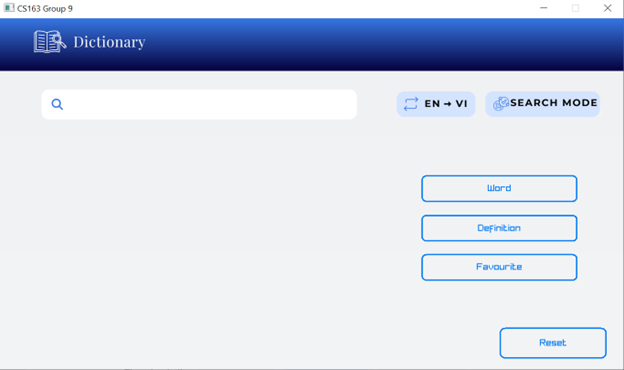
1.	Users can switch between data sets

There is a button: 

- 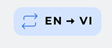

- 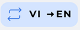

- 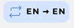 

- 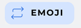

It switches between these button when clicked.

2.	Users can search with a keyword.
 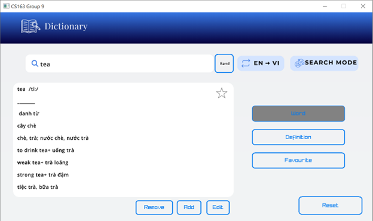

- Choose Word mode, enter a word that you want to find in the search bar

3. Users can search with a definition

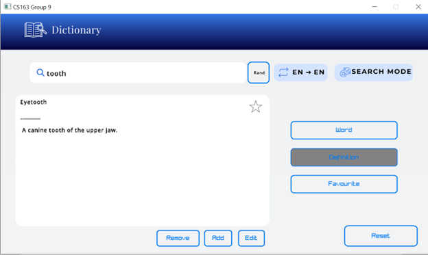

- Choose Definition mode, enter definition that you want to find the corresponding word in the search bar

4. Users can view the history of search words again.
 
 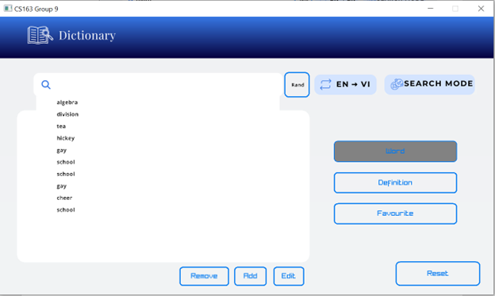

- Click the search bar, when you haven’t entered the search bar, you can view the history.

5.	Users can add a new word and its definition
 
  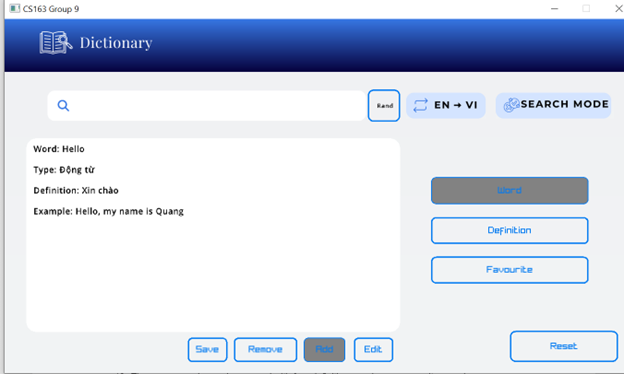

- Choose mode Word 
- Choose Add mode
-	Enter the format in order to create new word

6.	Users can edit the definition of an existing word
 
 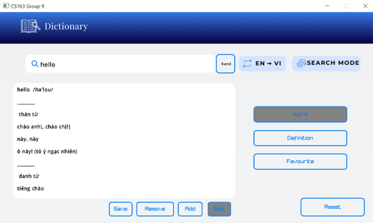
 - Search word that you want to edit, choose Edit button. Click any line you want to edit
 7.	Users can remove a word from the dictionary
 
 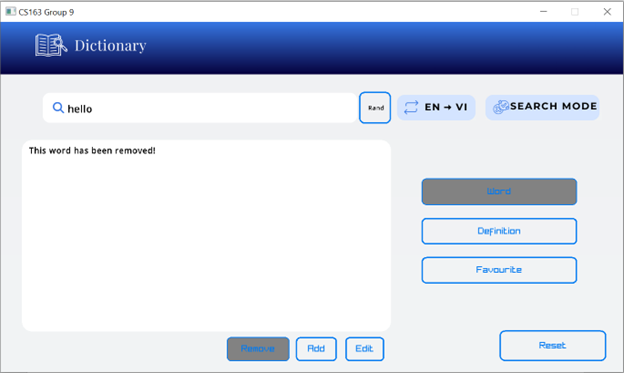
- Search word that you want to remove, choose Remove button. The word will be removed
8.	Users can reset the dictionary to its original state
 
 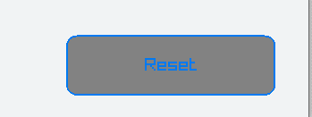
- There is a Reset button in the down-right corner of the frame. The dictionary will be reset after this button is clicked
9.	Users can view a random word and its definition

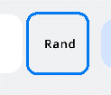

- Choose mode Word. Choose the random button (is on the right side of the search bar) 

10.	Users can view their favorite list

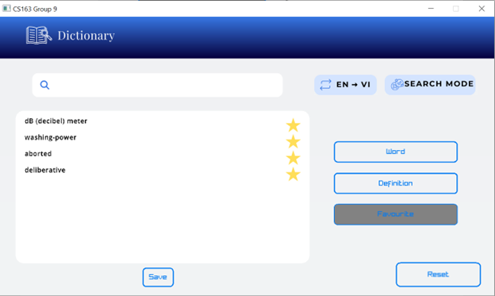
 

- Click Favourite button to see the favorite list

11. Users can remove/add a word from their favorite list

  - When searching for any word, there is a Star. 

    - When it is non favourite word
         

    - When it is favourite word
         

- You can add/remove to favourite list when click that Star

11.	The app can make random a word with four definitions, and users guess its meaning
 
 

- When entering the SearchMode button, it will change to the Quiz mode.
- Choose mode Word, then The app can make random a word with four definitions, and users guess its meaning

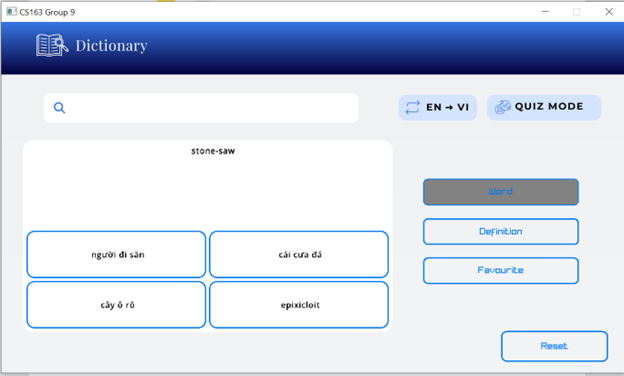

12.	The app can provide a random definition with four keywords, and users choose the correct word

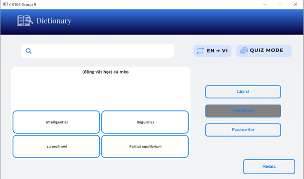
- Choose Definition in the Quiz mode, the app can provide a random definition with four keywords, and users choose the correct word

13.	Show suggestions bar when searching
 

- Entering the search bar, the suggestions bar will show for you

14.	The app has emoji data set

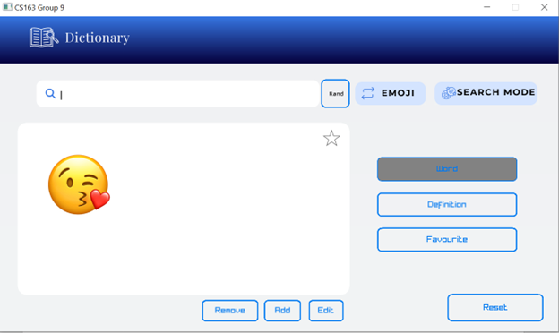

## Data structures and algorithms

1. Abstraction:

- Our project is to make a dictionary that help user look up word in some type (Anh_Viet, Anh_Anh, Viet_ Anh and emoji). 

2. Introduction: 

- Some header file we have in core(for back end) in project: Word.h, Trie.h, Dict.h, Map.hpp, Api.h,Quiz.h.

  - Word.h: file for saving data

  - Trie.h: file for build trie data structure 

  - Dict.h: file for creating dict 

  - Map.hpp: file for build map data structure

  - Api.h: file for application 

  - Quiz.h: file for quiz

3. Data storage  

- We store data in folder data. First we got raw data in text file and wrote it to binary file to make it faster to load data when launching project. For each type of dictionary, we have dataset equivalently. 

  - Anh Viet dataset contains 105866 words, raw file is Anh_Viet.txt (14982KB), the file for using is Anh_Viet.dat (24572KB- it can be modified when we add or remove). We save Anh_Viet_Origin.dat for reset the dict when needed

  - Anh_Anh dataset contains 116989 words, raw file is Anh-Anh.txt (13466KB), the file for using is Anh_Anh.dat. We  We save Anh_Viet_Origin.dat for reset the dict when needed

  - Viet_Anh dataset contains 54373 words, raw file is Viet_Anh.txt(2144KB), the file for using is 6393KB. We save Viet_Anh_Original.dat for reset the dict when needed)
  - Emoji dataset contains 1717 icon, raw file emoji.txt(149KB) , file for using emoji.dat(200KB)
  - For each type of data set we have files for save history and favourite words.

4. Data structure and Algorithm

- We use class Word among all dataset (Anh Viet, Anh Anh, Viet Anh, Emoji)

- We use wstring for inputing unicode character from file

Class Word:
- Class Type: 

  - wstring type (used for save the type of word (danh tu , tinh tu, pho tu,....)

  - Wstring phrase (used for save the collocation, phrasal verb)

  - Bool Isdefinition ( used for check if we need to use Class Definition)

  - Class Definition:

    - Wstring  meaning ( used for save the meaning of the word)
    - vector <wstring> examples( used for save the example of each meaning)
    - Bool Isexample ( used to check if we need to use vector examples)

  - wstring word (save word)
  -   wstring pronounciation (save pronunciation)

  -   wstring imagePath (We use imagePath only for Emoji dataset and set default is Null)
    -   bool isType for checking if we need to use Class Type

(All the bool datatype above is used when writing or reading from binary file)

Class Dict: 

- vector<Word> words  //contain all words
- Trie<int> Map // a trie 
- vector<wstring> FavouriteList // a favourite list for user 
- vector<wstring> HistoryList // a History list for the word that user have searched
- Trie<Trie<int>> WordsofDef // 

 We need

Structure and Algorithm for inserting, deleting and searching data

Class Trie : (building trie ) 

- Class TrieNode:

  - ValueType value (any value type)
  - Map <wchar_t, TrieNode*> children ( for each char in a word, we save it with its node, then it is convenient for us to get the node of the next character in word)
  - Bool isEndOfWord ( used to check if this value is end of word)

Insert: 
- Algorithm: 
    - Start at the root node. For each character in the string: If the character's node doesn't exist as a child, create a new node and add it as a child of the current node. Move to the child node representing the current character. At the end of the string, mark the last node as a terminal node (indicating the end of a word).
- Time complexity: O(sizeofWord * log2(M)) (M is the number of character in a word)

Explain: For each character in word, we need to go through map to get the node of next character, there for each character have log2(M). Hence, the word consume sizeofWord *log2(M) 
- Space complexity O(sizeofWord)
Explain, we need space for each character in word and map will need more space. Finally, we have O(sizeofWord) + O(sizeofWord)

Average time consuming for insertion: 2 millisecond
- Delete:

  - Algorithm: Perform a search to ensure the string exists in the Trie. Start at the node representing the last character of the string. While traversing back up: If a node has no children other than the current node, delete that node. Stop when you encounter a node with more than one child, or when you reach the root.
  - Time and space complexity is the same with insertion
  - Average time consuming for Deletion: 1 millisecond

- Search:

  - Algorithm :Perform a search to ensure the string exists in the Trie. Start at the node representing the last character of the string. While traversing back up: If a node has no children other than the current node, delete that node. Stop when you encounter a node with more than one child, or when you reach the root.
  - Time and space complexity is the same with insertion
  - Average time consuming for Search: 3 millisecond

Class Map: 

  Map is based on AVL tree

- Insert: 
  - Time complexity: O(log2W) (W : number of characters user input)
  - Space complexity: O(1)
- Search:
	 
	- Time complexity: O(log2W)
	- Space complexity : O(1) 
- Remove
  - Time complexity: (Olog2W) 
  - Space complexity: O(1)

5. Some function for some feature: 
- Function auto complete: ( suggesting the entire word or definition when user searching)
    - For word: 
      - Prototype of function: 
std::vector<wstring>ApiSearch::getAutoCompleteListForWord(Constants::TypeDict typeDict, std::wstring word) 
      - This function help us suggest all word that close the key character that user input.
      - Algorithm: First we take all character that user inputs to trie. T.hen we add to the result all characters that can appear after the character user input
      - Time complexity: O(Count Of Node in Trie * log2W) (W : set of character may be used)

    - For definition:
		  - Prototype of function:
std::vector<wstring>ApiSearch::getAutoCompleteListForDefinition(Constants::TypeDict typeDict, std::wstring definition)
	    - This function help us suggest all definition that close to user input
	
      - Algorithm:  we take a word form user and then we check what word’s meaning contains that word. Then we have a vector of word. If user input new word, we will remove some word in vector that do not contain the new word. We will repeat again and again until user stop inputing.

	  - Time complexity:  O(S*n*(log2W)2) (S: size of input, n: number of words, W: set of character may be used)
	Space complexity: O(S*n) (S: size of input, n:number of words)

## License

This project is licensed under the `GPL-3.0 License` - see the [LICENSE](./LICENSE) file for details.